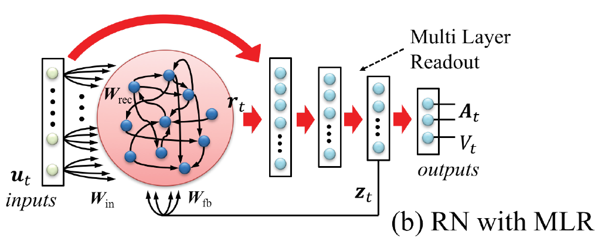
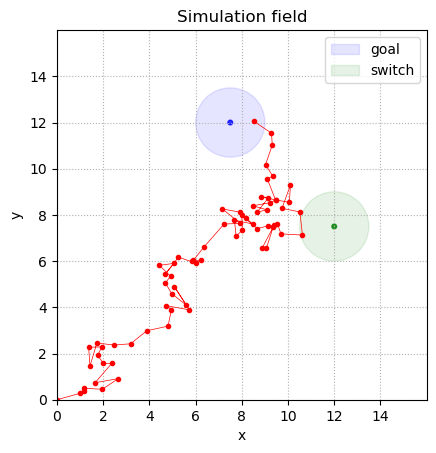

# Multi Layer Readout Echo State Network
Reinforcement learning using Echo State Network (ESN) with multi layer feed forward readout 
  Implementation based on the paper _**Reinforcement Learning of a Memory Task Using an Echo State Network with Multi-layer Readout**_

Image extracted from the paper Reinforcement Learning of a Memory Task Using an Echo State Network with Multi-layer Readout 

  